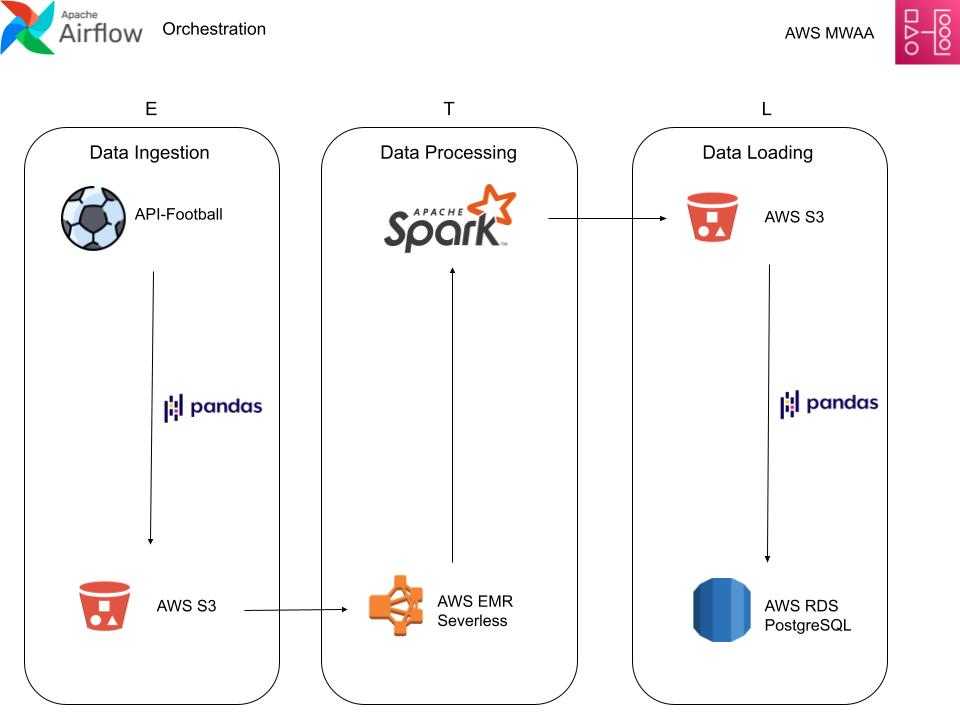

# Football Player Stats ETL Pipeline

## Overview

This project implements an ETL pipeline to extract, transform, and load football player statistics for the current season. The data pipeline leverages various AWS services, Apache Airflow for orchestration, and Apache Spark for data transformations. The processed data is stored in an AWS RDS PostgreSQL database for further analysis.



---

## Architecture

### Workflow Overview

1. **Extract**:
   - Football player statistics are fetched from a football API using **pandas**.
   - Extracted data is stored as parquet files in an Amazon S3 input folder.

2. **Transform**:
   - An **Amazon EMR Serverless** Spark application processes and transforms the raw parquet data into a cleaned, enriched format.

3. **Load**:
   - The transformed data is uploaded back to the S3 bucket in an output folder and logs uploaded to logs folder.
   - Data is then ingested into an **AWS RDS PostgreSQL** database for querying and analysis.

4. **Orchestration**:
   - The workflow is managed using **Apache Airflow**, ensuring a reliable and repeatable ETL process.

---

## Technology Stack

- **Data Orchestration**: [Apache Airflow](https://airflow.apache.org/) (Dockerized)
- **Data Extraction**: Python with pandas
- **Data Transformation**: Apache Spark on Amazon EMR Serverless
- **Data Storage**:
  - **Raw & Processed Data**: Amazon S3
  - **Relational Database**: AWS RDS PostgreSQL
- **Cloud Database**: PostgreSQL

---

## Features

- **API Integration**: Automates the collection of football stats using a live football API.
- **Serverless Processing**: Efficient, scalable data transformation using EMR Serverless.
- **Cloud Storage**: Persistent storage of raw and processed data in Amazon S3.
- **Relational Database**: PostgreSQL for analytical queries and reporting.
- **End-to-End Orchestration**: Airflow DAGs automate and monitor the entire ETL workflow.

---

## Prerequisites

1. **Python Environment**:
   - Install Python 3.10 or later.
   - Install required libraries:

     ```bash
     pip install -r requirements.txt
     ```

2. **AWS Account**:
   - S3 bucket setup for raw and processed data.
   - EMR Serverless configured.
   - RDS PostgreSQL instance with necessary tables.
3. **Apache Airflow**:
   - Use the [official Docker image](https://airflow.apache.org/docs/docker-stack/) for setup.

---

## Setup

1. **Environment Variables**:
   Set the following environment variables for AWS credentials, API keys, and database connections:

   ```bash
   export AWS_ACCESS_KEY_ID=your-access-key-id
   export AWS_SECRET_ACCESS_KEY=your-secret-access-key
   export FOOTBALL_API_KEY=your-football-api-key
   export RDS_HOST=your-rds-endpoint
   export RDS_PORT=your-rds-port
   export RDS_USER=your-database-username
   export RDS_PASSWORD=your-database-password
   export RDS_DATABASE=your-database-name
